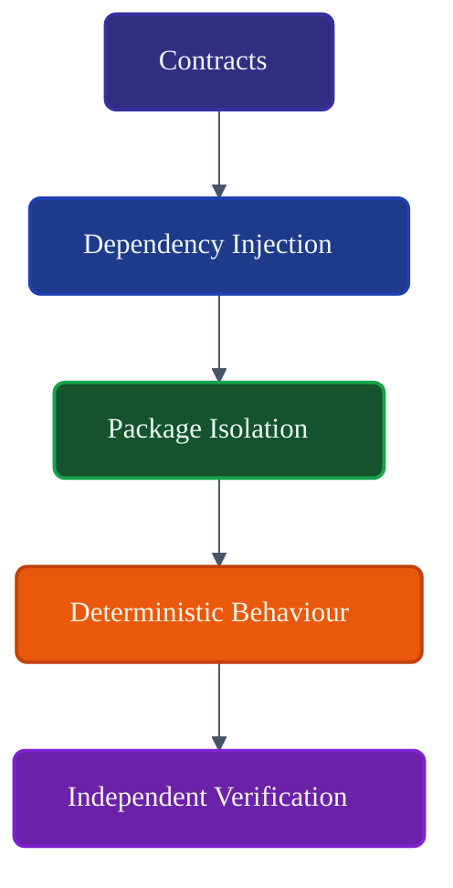
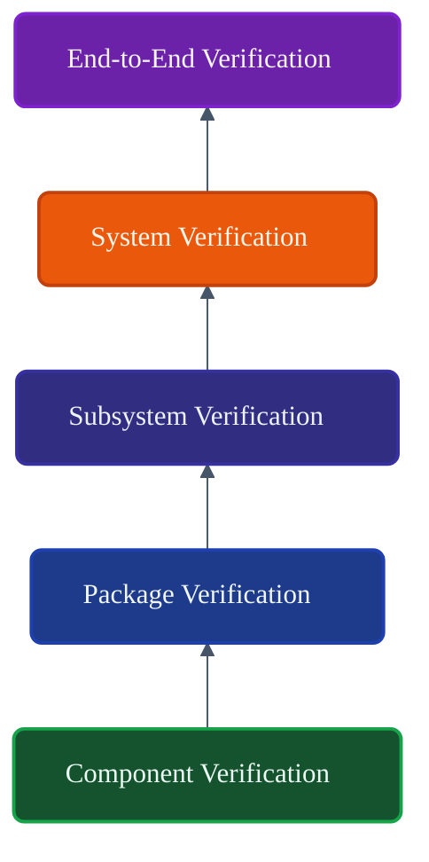
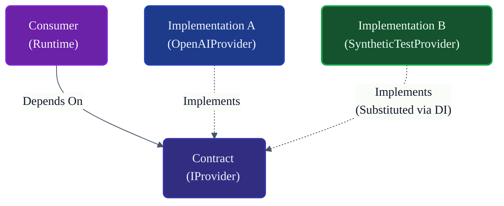
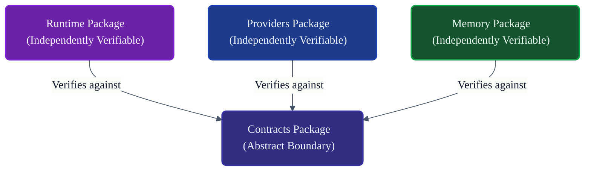

# VoxCore Testability Design

This document defines the architectural principles, package boundaries, dependency patterns, component isolation strategies, observability support, determinism requirements, dependency injection considerations, and implementation constraints that enable comprehensive testing across the VoxCore platform.

It answers exactly one engineering question: **"How has VoxCore been architecturally designed to enable reliable, maintainable, deterministic, and isolated testing?"**

This document defines **architectural testability**. It does not define unit tests, integration tests, testing frameworks, test cases, testing libraries, CI/CD pipelines, or code coverage requirements.

---

## 1. Purpose

Architectural testability ensures that the system is built in a way that allows its behavior to be verified reliably and independently.

Without explicit design-for-testability:
* **Packages become tightly coupled**: Verifying the `Runtime` inadvertently requires a live database connection because `Storage` cannot be substituted.
* **Mocking becomes difficult**: Consumers rely on concrete classes, forcing test authors to monkey-patch internal methods.
* **Failures become nondeterministic**: Tests randomly fail because of hidden global state or undocumented race conditions.
* **Regression testing becomes unreliable**: Minor infrastructure changes break hundreds of unrelated logic tests.
* **Refactoring becomes risky**: The lack of stable boundaries means verifying behavior post-refactor is impossible.

VoxCore is architected so every package can be verified independently without requiring the entire system to be booted. Testability is an intrinsic property of the architecture, not an afterthought.

---

## 2. Testability Philosophy

The architecture of VoxCore guarantees testability through the following principles:

* **Testability by Design**: Code must be written assuming it will be tested in isolation. Testability is never sacrificed for convenience.
* **Isolation Before Integration**: Every component and package must be provably correct in a vacuum before it is verified in a composed system.
* **Dependency Inversion**: By depending on abstractions, any subsystem can be fed synthetic data without altering the consuming logic.
* **Deterministic Behaviour**: Given the same configuration, dependencies, and input, a component must always yield the exact same output or state transition.
* **Replaceable Dependencies**: The Composition Root guarantees that dependencies can be hot-swapped for verification purposes.
* **Observable Behaviour**: The system emits state changes and errors through stable contracts, making verification assertions trivial.
* **Minimal Shared State**: Global variables and implicit singletons are strictly forbidden to prevent test interference.
* **Framework Independence**: The architecture is testable without relying on specific mocking libraries or runtime patching tools.

---

## 3. Architectural Enablers

The following architectural decisions directly enable testability:

| Architectural Decision | Contribution to Testability |
| :--- | :--- |
| **Package Boundaries** | Restricts the blast radius of verification. Verifying `Security` does not require `Providers`. |
| **Contracts** | Provides the interfaces required to substitute external dependencies with safe, synthetic implementations. |
| **Dependency Injection** | Separates the "creation" of objects from their "usage", allowing tests to inject alternate logic trivially. |
| **Public Interfaces** | Provides a stable target for assertions. Internal refactors do not break public behavior verifications. |
| **Error Model** | Ensures that failures are returned deterministically rather than crashing the testing process unexpectedly. |
| **Observability** | Allows verification of invisible internal states (e.g., verifying that a metric incremented correctly). |
| **Configuration Isolation**| Prevents tests from accidentally reaching production environments by requiring explicit configuration injection. |
| **State Machines** | Constrains logic into finite, mathematically verifiable paths with explicit valid and invalid transitions. |

---

## 4. Testability Levels

VoxCore supports verification at multiple conceptual layers. Each layer builds upon the guarantees of the previous layer.

1. **Component Verification**: Validating a single class or module in absolute isolation (e.g., asserting a specific Strategy sorts memories correctly).
2. **Package Verification**: Validating that the internal modules of a package collaborate correctly according to the package's public interface.
3. **Subsystem Verification**: Validating the interaction between a consumer and its immediate dependencies (e.g., Runtime communicating with a simulated Provider).
4. **System Verification**: Validating the entirely assembled Object Graph using synthetic external borders (e.g., simulated network endpoints).
5. **End-to-End Verification**: Validating the entire platform interacting with real external systems (e.g., real LLMs, real databases).

---

## 5. Isolation Strategy

Architectural boundaries guarantee that packages can be verified without cross-contamination.

* **Package isolation**: No package depends on the internal concrete details of another. Verification operates entirely on the `Contracts` boundary.
* **Runtime isolation**: The engine logic can be verified without booting a web server or connecting to an external API.
* **Provider isolation**: API communication logic (e.g., OpenAI wrappers) can be verified by substituting the HTTP Transport layer.
* **Storage isolation**: Persistence logic can be verified against a temporary or in-memory instance without affecting global databases.
* **Memory isolation**: Retrieval algorithms can be verified using fixed embedding arrays, guaranteeing mathematical determinism.
* **Tool isolation**: Tool execution logic can be verified without actual sandbox provisioning by substituting the execution engine.
* **Plugin isolation**: Extensibility can be verified by registering synthetic plugins and asserting the system invokes them correctly.
* **Transport isolation**: Network adapters can be verified using loopback connections, isolating them from business logic.

---

## 6. Dependency Replacement

The primary mechanism for isolated verification is dependency replacement, facilitated by the Dependency Injection Design.

* **Contract-based replacement**: Consumers accept `ITool`, `IProvider`, or `IStorage` in their constructors. Verification processes pass synthetic implementations of these contracts.
* **Provider substitution**: The Runtime can be tested by providing a synthetic LLM that always returns a fixed string, verifying orchestration without burning API credits or risking network timeouts.
* **Storage substitution**: Memory retrieval can be verified by substituting PostgreSQL with a simple in-memory `DictionaryStorage` implementation of the `IStorage` contract.
* **Configuration substitution**: Security logic can be verified by injecting synthetic `IConfiguration` objects, exploring boundary conditions (e.g., testing behavior when `MAX_TOKENS = 0`).
* **Security substitution**: The API package can be verified by injecting a synthetic `IAuthorization` service that explicitly returns `ALLOW` or `DENY`, bypassing real JWT decoding.
* **Observability substitution**: Telemetry output can be verified by injecting an in-memory `ILogger` and asserting that specific error codes were emitted during a failure scenario.

---

## 7. Determinism

To be testable, the architecture must be deterministic.

* **Identical inputs produce predictable behaviour**: A component invoked with the same arguments, state, and dependencies must return the identical result every time.
* **Deterministic state transitions**: State Machines must not rely on random numbers or internal clocks to decide the next state.
* **Controlled configuration**: The environment must be strictly injected. A component cannot read `os.environ` directly, as this introduces hidden state.
* **Controlled dependency graphs**: Because there is no Service Locator, the dependency graph is static and mathematically verifiable at boot.
* **Stable error contracts**: A failure in a dependency must always produce the exact same translated error object, allowing callers to be verified against specific failure modes reliably.

---

## 8. Observability Support

The Observability Package actively supports verification without altering execution behavior.

* **Logs**: Asserting that a specific semantic warning was logged when a tool failed.
* **Metrics**: Asserting that the `active_sessions` gauge correctly increments and decrements during a state transition.
* **Traces**: Asserting that a Trace ID remains consistent across an entire pipeline execution.
* **Diagnostics**: Ensuring that fatal failures output predictable diagnostic snapshots.
* **Health reporting**: Verifying that the system correctly reports `Degraded` when a synthetic dependency is programmed to fail.

Because Observability is passive, these verifications do not risk Heisenbugs (where observing a system changes its behavior).

---

## 9. State Verification

VoxCore orchestrates execution via explicit State Machines. This design pattern inherently guarantees high testability.

* **State transitions**: Verification simply asserts `current_state + event = expected_state`.
* **Valid states**: The architecture defines exactly what states exist. Verification exhaustively tests all combinations.
* **Invalid states**: The architecture defines forbidden transitions. Verification asserts that injecting illegal events produces the correct architectural Error.
* **Lifecycle verification**: Ensures the Agent transitions cleanly from `Initialized` to `Shutdown`.
* **No duplication**: Because state transitions are centralized in the Runtime Kernel, they are verified once, guaranteeing predictability for the entire platform.

---

## 10. Package Collaboration Verification

The architecture allows for the isolated verification of collaboration points.

* **Runtime ↔ Providers**: Verified by ensuring the Runtime properly adapts its prompts to the `IProvider` contract and correctly parses the returned abstraction.
* **Memory ↔ Storage**: Verified by ensuring the Memory package correctly queries the `IStorage` interface based on its internal semantic ranking logic.
* **API ↔ Security**: Verified by ensuring the API aborts the request immediately if the `IAuthorization` contract returns `DENY`.
* **All Packages ↔ Configuration**: Verified by ensuring components react predictably to boundary values (e.g., negative timeouts) supplied via `IConfiguration`.
* **All Packages ↔ Observability**: Verified by ensuring telemetry events are fired for all critical path operations.

---

## 11. Dependency Rules Supporting Testability

The architecture enforces strict dependency rules that directly mandate testability.

* **Consumers depend on Contracts**: Mandates that every consumer can be decoupled from real infrastructure during verification.
* **Implementations remain replaceable**: Guarantees that synthetic implementations can be substituted safely.
* **Packages remain independently verifiable**: Guarantees that the test matrix does not grow exponentially with every new package.
* **Internal modules remain encapsulated**: Prevents verification code from becoming coupled to unstable internal refactoring.
* **No cyclic dependencies**: Prevents infinite loops during graph construction, making setup and teardown of verification environments deterministic.

---

## 12. Testability Invariants

The following invariants must hold true under all conditions:

1. **Every package has a stable public boundary.** (Verification targets the interface, not the implementation).
2. **Every dependency can be substituted.** (Constructor injection ensures no hardcoded instantiations exist).
3. **Configuration remains externalized.** (No component reads global variables or files directly from disk).
4. **State transitions remain deterministic.** (Identical events yield identical states).
5. **Errors remain observable.** (Verification can always inspect failures rather than hanging indefinitely).

---

## 13. Design Constraints

* **Architecture shall remain testable without framework-specific tooling.** (e.g., The system does not require `@patch` decorators to intercept network calls; it requires injecting a synthetic `ITransport`).
* **Packages shall remain independently verifiable.**
* **No hidden global state.** (Singletons must be managed exclusively by the Composition Root).
* **No implicit runtime dependencies.** (All requirements are declared in constructors).
* **No circular dependencies.** (Acyclic graphs ensure predictable setup phases).

---

## 14. Traceability

| Architectural Decision | Improves | Primary Beneficiary |
| :--- | :--- | :--- |
| **Constructor Injection** | Dependency Replacement | Test Authors |
| **Strict Encapsulation** | Refactoring Safety | Core Maintainers |
| **Error Translation** | Failure Determinism | Consumers / Integrators |
| **State Machines** | Logical Predictability | All Developers |
| **Contracts** | Provider Substitution | QA / CI Systems |

---

## 15. Conclusion

The VoxCore architecture is intentionally designed to maximize testability through modular boundaries, dependency inversion, deterministic behavior, explicit ownership, and stable public interfaces. By architecturally separating the definition of logic (Contracts) from the execution of logic (Implementations) and the creation of logic (Composition Root), VoxCore guarantees that its behavior can be comprehensively verified in isolation without requiring architectural modifications.

---

## Required Tables

### Table 1: Documentation Relationships

| Document | Responsibility |
| :--- | :--- |
| **Package Architecture** | Defines package boundaries. |
| **Contracts Package** | Enables mocking through abstractions. |
| **Public Module Interfaces**| Defines stable testing boundaries. |
| **Dependency Injection** | Enables dependency replacement. |
| **Error Model** | Enables deterministic failure testing. |
| **Testability (This Doc)** | Defines architectural support for testing. |

### Table 2: Architectural Enablers

| Architectural Decision | Contribution to Testability |
| :--- | :--- |
| **Package Isolation** | Limits the scope of verification required per change. |
| **Interface Adapters** | Shields core logic from untestable third-party SDKs. |
| **No Global State** | Prevents verification environments from cross-polluting. |
| **Centralized Config** | Allows exhaustive testing of boundary configuration values. |

### Table 3: Verification Levels

| Level | Purpose |
| :--- | :--- |
| **Component** | Verify single-responsibility logic (e.g., a sorting Strategy). |
| **Package** | Verify internal collaboration via public interfaces. |
| **Subsystem** | Verify cross-package integration via Contracts. |
| **System** | Verify the fully composed object graph with synthetic borders. |
| **End-to-End** | Verify real-world deployment viability. |

### Table 4: Dependency Rules Supporting Testability

| Rule | Reason |
| :--- | :--- |
| **Dependency Inversion** | Concrete implementations can always be swapped. |
| **Constructor Signatures**| Missing dependencies are caught before test execution. |
| **Acyclic Constraints** | Setup phases remain finite and predictable. |

### Table 5: Testability Invariants

| Invariant | Reason |
| :--- | :--- |
| **No Magic Mocks** | The architecture must not rely on language introspection. |
| **Deterministic Errors** | Failures must be repeatable on demand. |
| **Passive Observability** | Monitoring must never alter the outcome of a test. |

### Table 6: Traceability Matrix

| Principle | Origin | Enforced By |
| :--- | :--- | :--- |
| **Isolation** | Hexagonal Architecture | Package Boundaries |
| **Determinism** | State Machine Design | Runtime Kernel |
| **Substitutability** | Liskov Substitution Principle | Contracts Package |

---

## Required Diagrams

### Diagram 1: Testability Architecture

### Diagram 2: Verification Pyramid

### Diagram 3: Dependency Replacement

### Diagram 4: Package Isolation

