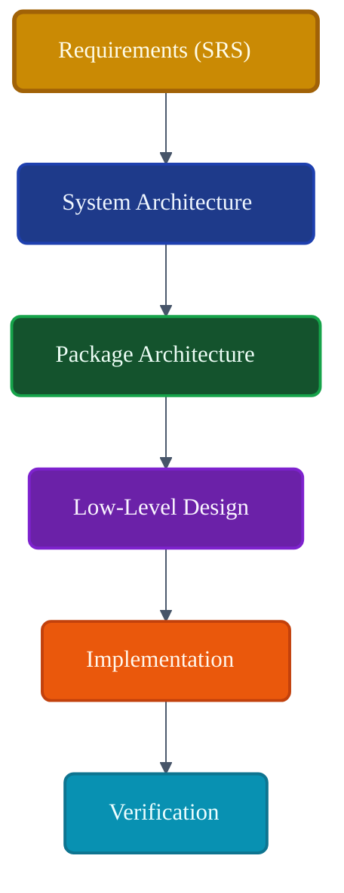
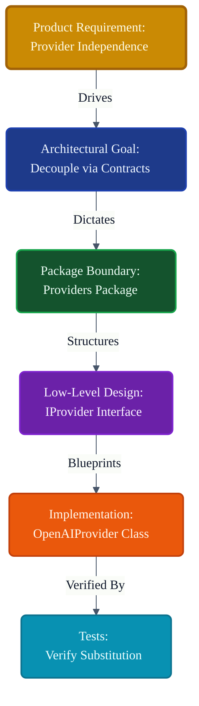
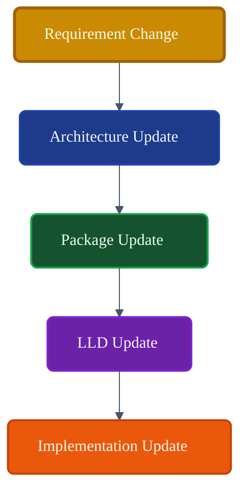

# VoxCore Traceability Matrix

This document establishes end-to-end traceability across the entire engineering documentation hierarchy, ensuring that every requirement can be followed through the architecture, package design, low-level design, and ultimately to implementation.

It answers exactly one engineering question: **"Can every implementation artifact be traced back to an approved architectural decision and product requirement?"**

This document introduces no new architecture. It serves as the architectural verification map, proving that the documentation suite is complete, internally consistent, and fully capable of guiding execution.

---

## 1. Purpose

Traceability guarantees architectural integrity throughout the project lifecycle.

Without traceability:
* **Requirements become disconnected**: Developers build features nobody asked for.
* **Implementations drift**: The code no longer reflects the architecture, making the documentation obsolete.
* **Architecture becomes unverifiable**: It becomes impossible to prove that a security constraint was actually implemented.
* **Maintenance becomes difficult**: A bug fix in one module breaks an undocumented assumption in another.
* **Onboarding becomes slower**: New engineers cannot trace *why* a particular design decision was made.

Traceability ensures that every line of code written for VoxCore exists to satisfy an approved, documented architectural requirement.

---

## 2. Traceability Philosophy

The governance of VoxCore documentation adheres to the following principles:

* **Single Source of Truth**: There is exactly one authoritative document for any given architectural tier.
* **End-to-End Traceability**: A change in the source code can be traced up to the LLD, up to the Architecture, and up to the Product Requirement.
* **Explicit Ownership**: Every artifact (document or code) has a defined owner.
* **No Orphan Artifacts**: Every document must be consumed by a downstream document or implementation.
* **Documentation Before Implementation**: Code is never written until the corresponding LLD is approved.
* **Incremental Evolution**: Changes propagate linearly from the top down; code does not dictate architecture.
* **Consistency Across Layers**: Terminology remains mathematically consistent from the SRS down to the python modules.

---

## 3. Documentation Hierarchy

VoxCore follows Documentation-Driven Development. The stack is strictly layered.

| Layer | Defines | Consumed By |
| :--- | :--- | :--- |
| **SRS** | Product requirements | System Architecture |
| **System Architecture** | Logical architecture | Package Architecture |
| **Package Architecture** | Package boundaries | Low-Level Design |
| **Low-Level Design** | Implementation blueprint | Source Code |
| **Implementation** | Executable system | Verification |

The dependency direction is strictly downward. Lower layers realize the constraints defined by the upper layers.

---

## 4. Requirements → Architecture Mapping

At the highest level, traceability guarantees that business needs become logical structures.

* **Requirements** (e.g., "The system must support multiple LLMs")
  ↓
* **Architectural Goals** (e.g., "Provider Independence")
  ↓
* **Logical Components** (e.g., "Provider Facade")
  ↓
* **Packages** (e.g., `voxcore/providers`)

Every architectural goal exists solely to fulfill an SRS requirement.

---

## 5. Architecture → Package Mapping

Traceability guarantees that logical boundaries become physical boundaries.

* **Logical Layers** (e.g., "The Intelligence Layer")
  ↓
* **Packages** (e.g., `voxcore/memory`, `voxcore/tools`)
  ↓
* **Responsibilities** (e.g., "Memory owns semantic retrieval")
  ↓
* **Dependencies** (e.g., "Memory depends on Contracts")

The Package Architecture realizes the System Architecture by organizing logic into distributable, owned modules.

---

## 6. Package → LLD Mapping

Traceability guarantees that physical boundaries are fully blueprint-mapped before coding begins.

* Each package defined in the Package Architecture has exactly one dedicated Package LLD (e.g., `17-memory-package.md`).
* Core runtime concepts (like the Pipeline and State Machines) have dedicated thematic LLDs (`03` through `11`, and `27-28`).
* Shared concerns (like Dependency Injection and Errors) have dedicated interface LLDs (`24` through `26`).

---

## 7. LLD → Implementation Mapping

The Low-Level Design translates architecture into code.

The LLD strictly defines:
* module organization (directories and files)
* public interfaces (Contracts)
* dependency rules (Constructor injection)
* state machines (Transitions and Events)
* runtime models (Agents, Sessions, Turns)

Implementation realizes these directly. The Implementation shall not redefine the architecture, introduce hidden dependencies, or invent new state machine transitions.

---

## 8. Implementation → Verification Mapping

The final stage of traceability guarantees that the built system matches the blueprint.

* **Architecture** (Defines boundaries)
  ↓
* **Implementation** (Writes code matching boundaries)
  ↓
* **Testing** (Injects synthetic boundaries)
  ↓
* **Verification** (Proves the code obeys the architecture)

The architecture enables verification natively, as defined in `29-testability-design.md`.

---

## 9. Ownership Traceability

Every architectural artifact must have a defined owner to prevent ambiguity.

| Architectural Artifact | Primary Owner | Derived From | Used By |
| :--- | :--- | :--- | :--- |
| **Runtime Kernel** | Core Team | Runtime Architecture | Execution Pipeline |
| **Providers** | Core Team | Package Architecture | Runtime / Plugins |
| **Memory** | Core Team | Package Architecture | Runtime |
| **Storage** | Infra Team | Package Architecture | Memory / Runtime |
| **Tools** | Core Team | Package Architecture | Runtime |
| **Plugins** | Extensibility Team | Package Architecture | Third-Party Devs |
| **Transport** | API Team | System Architecture | API Package |
| **Configuration** | Core Team | Package Architecture | All Packages |
| **Security** | Security Team | Architectural Goals | API / Runtime |
| **Observability** | SRE Team | Architectural Goals | All Packages |

---

## 10. Change Propagation

Traceability enforces how the system evolves over time. Architecture changes propagate downward only.

1. **Requirement changes** (e.g., "We now need visual multimodal support")
   ↓
2. **Architecture changes** (e.g., "Update Provider abstractions to accept images")
   ↓
3. **Package changes** (e.g., "Update Contracts package")
   ↓
4. **LLD changes** (e.g., "Update `27-runtime-data-models.md` to include Image Message Types")
   ↓
5. **Implementation updates** (e.g., "Write the Python code")

Code must not be modified to support a new feature until the LLD has been updated and reviewed.

---

## 11. Documentation Integrity Rules

* **No implementation without LLD**: Code written without a blueprint will be rejected.
* **No LLD without Package Architecture**: You cannot design the internals of a package that does not officially exist.
* **No Package Architecture without System Architecture**: You cannot draw physical boundaries without logical boundaries.
* **No orphan documents**: Every markdown file must be referenced by an index or matrix.
* **No conflicting ownership**: Two packages cannot claim to own the same public interface.

---

## 12. Traceability Invariants

The following invariants must hold true under all conditions:

1. **Every package has one owner.** (Responsibility is unambiguous).
2. **Every LLD document derives from approved architecture.** (No rogue design documents).
3. **Every implementation traces back to LLD.** (Code reflects design).
4. **Every architectural decision is documented.** (Tribal knowledge is forbidden).
5. **Every dependency is justified.** (No package imports another without it being listed in the LLD).

---

## 13. Design Constraints

* **Traceability shall remain complete.**
* **Documentation shall remain synchronized** with the codebase.
* **No undocumented implementation.**
* **No architectural ambiguity.**
* **Documentation evolves before implementation.**

---

## 14. Complete Documentation Matrix

The following matrix is the definitive inventory of the VoxCore design hierarchy.

| Layer | Document | Derived From | Consumed By | Status |
| :--- | :--- | :--- | :--- | :--- |
| **Requirements** | `01-system-requirements.md` | Product Needs | Architecture | Frozen |
| **Architecture** | `01-architectural-goals.md` | SRS | Architecture | Frozen |
| **Architecture** | `02-layered-architecture.md` | Arch Goals | Architecture | Frozen |
| **Architecture** | `03-runtime-architecture.md` | Layered Arch | LLD / Core | Frozen |
| **Architecture** | `04-component-architecture.md`| Runtime Arch | LLD / Core | Frozen |
| **Packages** | `01-package-responsibilities.md` | Component Arch| LLD Packages | Frozen |
| **Packages** | `02-package-dependency-rules.md` | Package Resp. | LLD Packages | Frozen |
| **Packages** | `03-package-communication.md` | Dependency Rules| LLD Interfaces | Frozen |
| **LLD Runtime** | `00-master-runtime-sequence.md` | Runtime Arch | Code | Frozen |
| **LLD Runtime** | `03-runtime-kernel.md` | Runtime Arch | Code | Frozen |
| **LLD Runtime** | `04-runtime-context.md` | Component Arch| Code | Frozen |
| **LLD Runtime** | `05-runtime-scheduler.md` | Runtime Arch | Code | Frozen |
| **LLD Runtime** | `06-runtime-event-bus.md` | Runtime Arch | Code | Frozen |
| **LLD Runtime** | `07-runtime-execution-pipeline.md` | Runtime Arch | Code | Frozen |
| **LLD Components** | `08-runtime-managers.md` | Component Arch| Code | Frozen |
| **LLD Components** | `09-runtime-services.md` | Component Arch| Code | Frozen |
| **LLD Components** | `10-runtime-strategies.md` | Component Arch| Code | Frozen |
| **LLD Components** | `11-stores-and-repositories.md` | Component Arch| Code | Frozen |
| **LLD Packages** | `12-api-package.md` | Package Resp. | Code | Frozen |
| **LLD Packages** | `13-runtime-package.md` | Package Resp. | Code | Frozen |
| **LLD Packages** | `14-contracts-package.md` | Package Resp. | Code | Frozen |
| **LLD Packages** | `15-providers-package.md` | Package Resp. | Code | Frozen |
| **LLD Packages** | `16-storage-package.md` | Package Resp. | Code | Frozen |
| **LLD Packages** | `17-memory-package.md` | Package Resp. | Code | Frozen |
| **LLD Packages** | `18-tools-package.md` | Package Resp. | Code | Frozen |
| **LLD Packages** | `19-plugins-package.md` | Package Resp. | Code | Frozen |
| **LLD Packages** | `20-transport-package.md` | Package Resp. | Code | Frozen |
| **LLD Packages** | `21-configuration-package.md` | Package Resp. | Code | Frozen |
| **LLD Packages** | `22-security-package.md` | Package Resp. | Code | Frozen |
| **LLD Packages** | `23-observability-package.md` | Package Resp. | Code | Frozen |
| **LLD Interfaces** | `24-public-module-interfaces.md`| Package Comm. | Code | Frozen |
| **LLD Interfaces** | `25-dependency-injection-design.md`| Component Arch| Code | Frozen |
| **LLD Interfaces** | `26-error-model.md` | System Arch | Code | Frozen |
| **LLD Models** | `27-runtime-data-models.md` | Runtime Arch | Code | Frozen |
| **LLD Models** | `28-runtime-state-machines.md` | Runtime Arch | Code | Frozen |
| **LLD Verification**| `29-testability-design.md` | All LLDs | Testing | Frozen |
| **LLD Verification**| `30-traceability-matrix.md` | Entire Suite | Process Audit | Frozen |

---

## 15. Future Evolution

As VoxCore evolves, traceability must be actively maintained:
* **Adding requirements**: Begins at the SRS, trickling down into a new Component or Package LLD.
* **Adding packages**: Requires an update to `Package Responsibilities`, followed by a new `Package LLD`.
* **Adding runtime components**: Requires an update to `Runtime Architecture`, followed by the `Runtime Kernel LLD`.
* **Updating architecture**: Modifying `Dependency Rules` requires auditing all downstream `Package LLDs`.
* **Maintaining traceability**: The Matrix (Table 6) must be updated as part of the Definition of Done for any architectural pull request.

---

## 16. Conclusion

The Traceability Matrix provides end-to-end verification that VoxCore's implementation is completely derived from approved requirements, architecture, and low-level design. By strictly cataloging the derivation and consumption of every architectural artifact, VoxCore ensures long-term maintainability, rigorous consistency, and absolute documentation integrity from the highest-level product requirement down to the lowest-level python module.

---

## Required Diagrams

### Diagram 1: Documentation Hierarchy

### Diagram 2: End-to-End Traceability

### Diagram 3: Documentation Dependency Graph

### Diagram 4: Change Propagation

