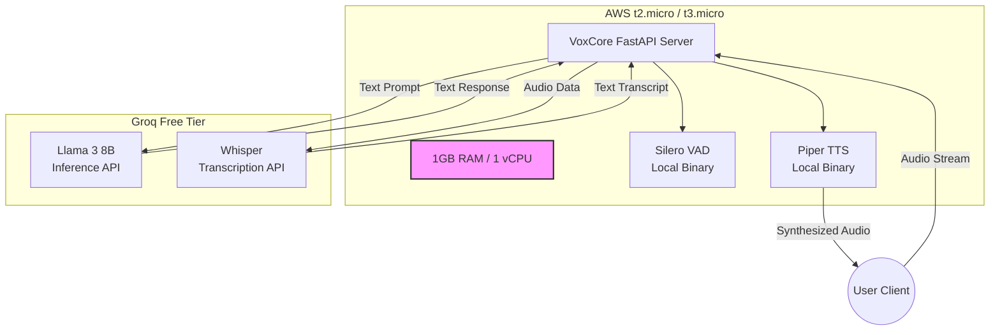

# Infrastructure and Costing Matrix

This document outlines the physical reality of the VoxCore deployment. It maps the logical system architecture to tangible cloud resources, detailing the infrastructure topology and the strict $0 budget constraints.

## Infrastructure Deployment Diagram

The following diagram illustrates how the system components are distributed between the local AWS server and external cloud APIs to respect hardware constraints.

## Cost Matrix and Resource Limits

The architecture is explicitly designed to maintain a permanent $0 operational cost. This is achieved through a combination of open-source local execution and rate-limited free-tier APIs.

| Component | Technology Choice | Monthly Cost | Constraints / Limits |
| :--- | :--- | :--- | :--- |
| **Compute Server** | AWS EC2 (t2.micro) | $0.00 | Free Tier: 750 hours/month, 1GB RAM, 1 vCPU, 30GB EBS Storage. |
| **Silence Detection** | Silero VAD | $0.00 | Uses ~2MB RAM locally. No usage limits. |
| **Speech-to-Text** | Groq (Whisper API) | $0.00 | Bounded by Groq API limits (e.g., Audio minutes per day). |
| **LLM Inference** | Groq (Llama 3 8B) | $0.00 | Rate Limited: ~30 Requests/Min, 14,400 Tokens/Min, 14,400 Tokens/Day. |
| **Text-to-Speech** | Piper TTS | $0.00 | Local execution. Bounded only by the EC2 vCPU processing speed. |
| **Total Cost** | | **$0.00 / month** | *Requires monitoring to ensure AWS Free Tier limits are not accidentally exceeded (e.g., network egress bandwidth limits).* |

## Operational Guidelines for Rate Limits

Because the LLM (Groq) operates on a free tier, it enforces strict Requests-Per-Minute (RPM) and Tokens-Per-Day (TPD) limits. 

1. **Development Phase**: The 14,400 Tokens/Day limit is sufficient for individual testing and development.
2. **Production/Scaling Phase**: If the application scales beyond a single user, the Groq limit will be exhausted rapidly. At that threshold, VoxCore must either:
   - Upgrade to a paid API tier (e.g., OpenAI `gpt-4o-mini` or paid Groq), which remains extremely cost-effective (fractions of a cent per request).
   - Migrate hosting from AWS Free Tier to a dedicated GPU instance (e.g., RunPod or AWS g4dn) to run local models, significantly increasing fixed monthly costs.
