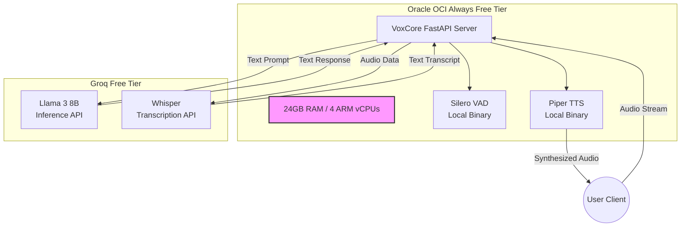

# Infrastructure and Costing Matrix

This document outlines the physical reality of the VoxCore deployment. It maps the logical system architecture to tangible cloud resources, detailing the infrastructure topology and the strict $0 budget constraints.

## Infrastructure Deployment Diagram

The following diagram illustrates how the system components are distributed between the local AWS server and external cloud APIs to respect hardware constraints.

## Cost Matrix and Resource Limits

The architecture is explicitly designed to maintain a permanent $0 operational cost. This is achieved through a combination of open-source local execution and rate-limited free-tier APIs.

| Component | Technology Choice | Monthly Cost | Constraints / Limits |
| :--- | :--- | :--- | :--- |
| **Compute Server** | Oracle OCI (ARM Ampere A1) | $0.00 | Free Tier: 24GB RAM, 4 ARM vCPUs, 200GB Block Storage. |
| **Silence Detection** | Silero VAD | $0.00 | Uses ~2MB RAM locally. No usage limits. |
| **Speech-to-Text** | Groq (Whisper API) | $0.00 | Bounded by Groq API limits (e.g., Audio minutes per day). |
| **LLM Inference** | Groq (Llama 3 8B) | $0.00 | Rate Limited: ~30 Requests/Min, 14,400 Tokens/Min, 14,400 Tokens/Day. |
| **Text-to-Speech** | Piper TTS | $0.00 | Local execution. Piper TTS is highly optimized for ARM architectures, resulting in blazing fast inference. |
| **Total Cost** | | **$0.00 / month** | *Requires monitoring to ensure OCI outbound bandwidth (10TB/month limit) is not exceeded.* |

## Oracle OCI Deployment Justification

The strategic decision to deploy on **Oracle OCI Always Free Tier** instead of traditional cloud free tiers (like AWS t2.micro or GCP e2-micro) was driven by the computational demands of a Voice AI pipeline.

### Pros
1. **Massive Compute & Memory:** Oracle provides 4 ARM Ampere A1 cores and 24GB of RAM for $0. This allows VoxCore to run the FastAPI app, Piper TTS, Silero VAD, and future multi-tenancy databases (like PostgreSQL and Redis) comfortably on a single node without memory exhaustion (OOM) errors. AWS's 1GB limit makes Dockerization almost impossible.
2. **ARM Optimization:** Piper TTS and many modern ONNX-based models run exceptionally well on ARM processors.
3. **Storage:** 200GB of block storage allows us to safely store large `.onnx` models, historical conversation logs, and Docker images.

### Limitations
1. **ARM (aarch64) Architecture:** Because the server runs on ARM, all Python dependencies (like `onnxruntime`, `torch`, or `psycopg2`) must have compatible ARM wheels. If a package is x86-only, it requires manual compilation from source which can be time-consuming.
2. **Resource Availability:** Depending on the OCI Home Region, provisioning the full 4-core A1 instance can sometimes hit "Out of Capacity" errors, requiring persistence or scripts to successfully allocate the instance.

## Operational Guidelines for Rate Limits

Because the LLM (Groq) operates on a free tier, it enforces strict Requests-Per-Minute (RPM) and Tokens-Per-Day (TPD) limits. 

1. **Development Phase**: The 14,400 Tokens/Day limit is sufficient for individual testing and development.
2. **Production/Scaling Phase**: If the application scales beyond a single user, the Groq limit will be exhausted rapidly. At that threshold, VoxCore must either:
   - Upgrade to a paid API tier (e.g., OpenAI `gpt-4o-mini` or paid Groq), which remains extremely cost-effective (fractions of a cent per request).
   - Migrate hosting from Oracle OCI to a dedicated GPU instance (e.g., RunPod or AWS g4dn) to run local models, significantly increasing fixed monthly costs.
